# 🦠 COVID-19-Detection

## Overview
Welcome to our COVID-19 Detection project! We've built a powerful machine learning pipeline that can classify X-ray images of lungs as either COVID-19 positive or normal. This project not only uses a variety of cutting-edge machine learning and deep learning models but also delves into the fascinating world of image transformation.

## Indian Institute of Technology Jodhpur Pattern Recognition and Machine Learning

### **Major Project**

**COVID-19 Detection using X-Ray Images**

By

👨‍🎓Preet Savalia

### 🚀 Introduction

The Coronavirus(COVID-19) has brought a worldwide threat to society. With the increasing number of cases and threat to life, it has become important to be able to predict whether a patient is positive or not with high accuracy. Machine learning can help us detect a COVID-19 infected patient by using the chest X-Ray images. The main task of this project is to classify the subjects as infected by covid or not using the X-Ray images of the chest. We have trained multiple classification models to determine the best model that classifies the X-Ray image. The best classification model is found to be a neural network with EfficientNet architecture giving an accuracy of *95.57%*.

### 📊 About the Dataset

The dataset used is “COVID-19 Radiography Database” consisting of X-Ray images and masks of lungs of people affected by COVID-19 virus, Viral Pneumonia, images displaying the Lung Opacity and those who are not affected. There are 3616 X-Rays of lung images of COVID-19 affected people and their respective masks and around 10.2k X-Rays of lung images of normal lungs and the respective masks. Dataset used for COVID-19 detection consists of X-Ray images and masks of COVID-19 affected and normal lungs.

### 📥 Downloading the data

The dataset is downloaded from kaggle by setting the environment variables for Kaggle API and downloading the zip file of the dataset. The folder consisting of images is then extracted from the zip file using the command *!unzip covid19-radiography-database*.

### 🛠️ Data Pre-Processing

**1. Creating masked images**

The dataset consists of X-Ray images as well as their masks which are around the lungs. To train a model, which focuses only on the lung region of the X-Ray, a dataset having masked images can be created. Using the paths of X-Ray images and masks of COVID-19 affected lungs and normal lungs, we can access the images. If the masked images for X-Ray images are present, then the X-Ray image and mask images are combined together to create a masked X-Ray image using *bitwise\_and()* function which computes the bitwise AND of each corresponding pixel value in the two input arrays.

**2. Undersampling**

It is observed that the number of X-Ray images of COVID-19 affected lungs and normal lungs are highly unbalanced (number of normal lung X-Ray images are around 3 times the affected lung images). To solve this, undersampling is performed which involves random removal of data from the majority class.

**3. Train Test Split**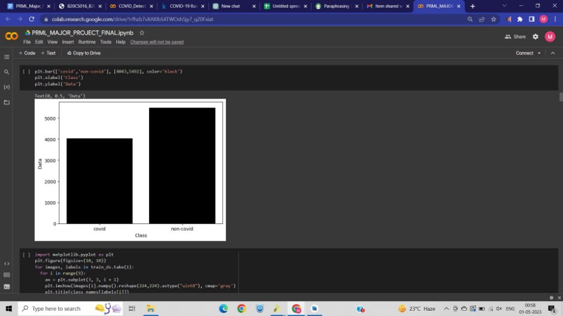

The pre-processed data is split into training and validation dataset in the ratio of 80:20 using the *tf.keras.utils.image\_dataset\_from\_directory()* function in color\_mode as grayscale and rgb.

**4. Visualisation**

After pre-processing and undersampling, the number of covid versus non-covid data samples were compared by plotting the bar graph between number of data samples and class.

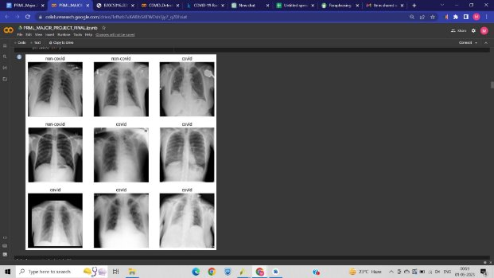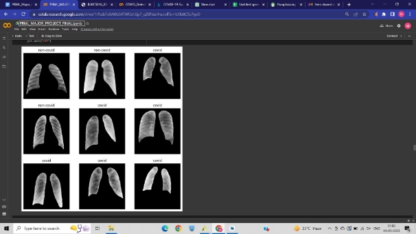

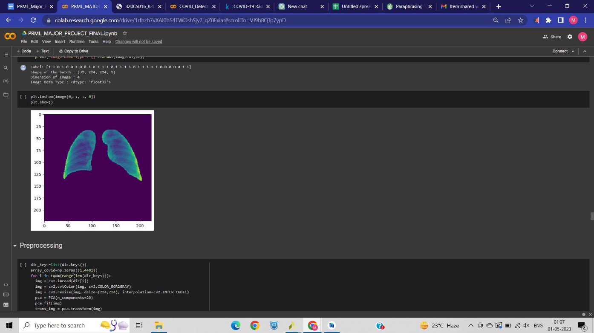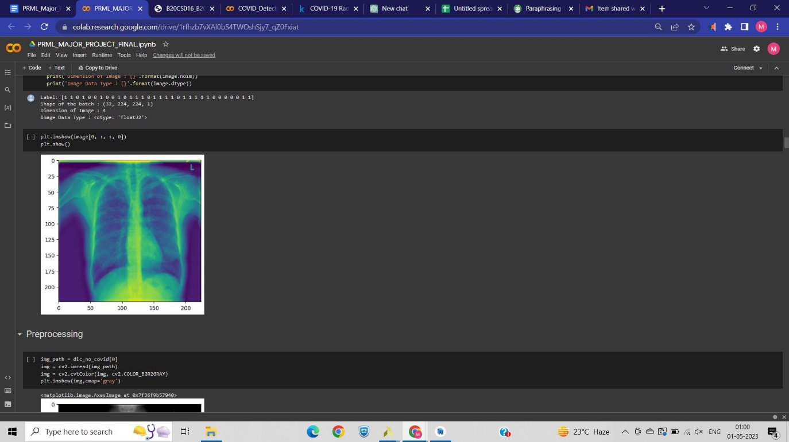

**5 📈 Dimensionality Reduction**

PCA can be used to identify the principal components of this dataset, which are linear combinations of the original features that capture the most variation in the data. Principal component analysis is performed on the data to reduce time and space. For different values of components, cumulative explained variance is calculated. The cumulative explained variance versus number of component graph is as shown below:

Figure 4: Cumulative Explained Variance versus Number of Components

The plot was plotted to determine the number of components to be used in PCA. The value of explained variance for n\_components = 20 was found to be around 99.5 %. Hence, the dimensionality reduction is done using the parameter n\_components = 20.

## 🧮 Classification Models

The dataset after applying PCA is used for training classification models. The dataset is split into train and test sets in the ratio 70:30. Various machine learning classification models were applied on the dataset with reduced dimensions to observe how each classifier performs on the dataset. The evaluation metrices for each model were evaluated and classification\_reports were displayed. The results obtained are:

Evaluating the metrices for unmasked dataset,

Figure 5: Classification Report for unmasked images

The results obtained for masked dataset is:

Figure 6: Classification Report for masked images

Figure 7: (a) Accuracies for various models trained on unmasked images (b) Accuracies for various models trained on masked images.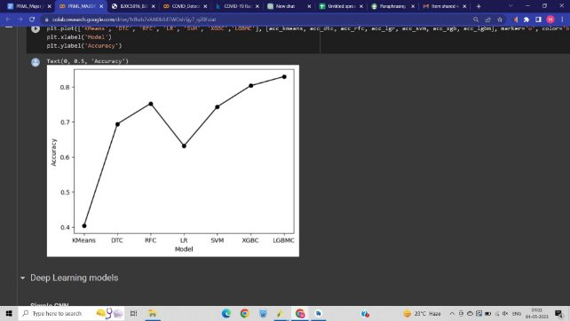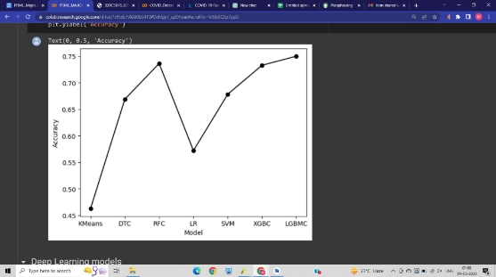

## 🧠 Deep Learning Models

**1. Simple CNN**

Simple CNN is applied on the dataset as they are able to learn features directly from the raw pixel data, without the need for manual feature extraction. The downloaded dataset was then turned into 32-batch-sized tensors, which were used to train and test the models. The model is trained with three convolutional layers, two pooling layers and 2 connected layers and an output layer to classify the images with 224 x 224 dimensions.The model is trained using a binary cross-entropy loss function and the Adam optimizer.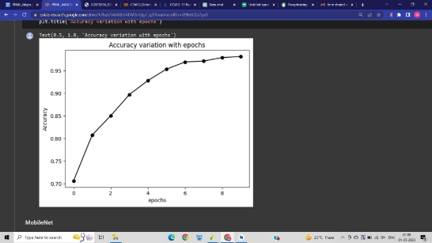

Figure 9: (a) Accuracy variation for Simple CNN trained on unmasked images (b) Accuracy variation for Simple CNN trained on masked images

**2. MobileNet**

MobileNet uses depth wise separable convolutions instead of traditional convolutions, which reduces the number of computations required while maintaining good accuracy. We have defined a MobileNet-based model for the X-Ray image classification with 2 classes, trained on RGB training dataset. It uses pre-trained weights from ImageNet dataset to extract features from the images and a global average pooling layer to reduce the feature map dimensions. A fully connected layer with a softmax activation function is added to produce the final probability distribution over the two classes.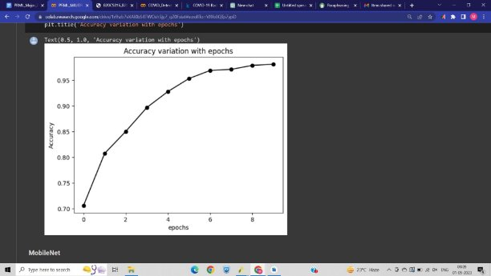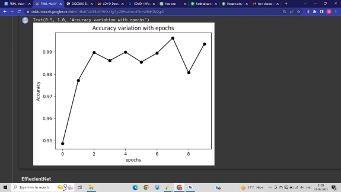

Figure 10: (a) Accuracy variation for MobileNet trained on unmasked images (b) Accuracy variation for MobileNet trained on masked images

**3. EfficientNet**

The model takes as input preprocessed images of size (224, 224, 3), applies the convolutional layers of the EfficientNetB0 model, applies global average pooling to the resulting feature maps, and outputs the predicted class probabilities for each input image.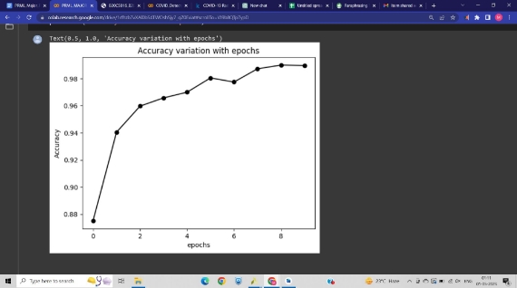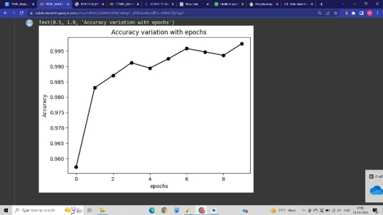

Figure 11: (a) Accuracy variation for EfficientNet trained on unmasked images (b) Accuracy variation for EfficientNet trained on masked images

## 7 Comparison for masked versus unmasked images
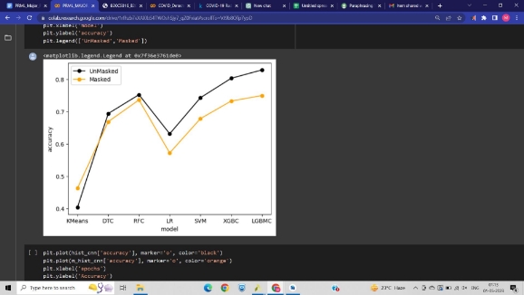

Figure 12: Accuracy comparison for different classification . Figure 13: Accuracy comparison for different values models for masked and unmasked datasets of epochs in simple CNN trained on masked and . unmasked datasets.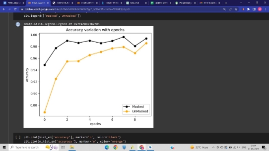

Figure 14: Accuracy comparison for different values Figure 15: Accuracy comparison for different values of of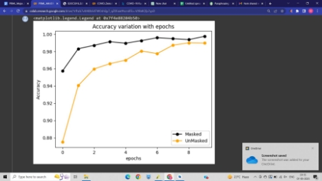 epochs in MobileNet trained on masked and epochs in EfficientNet trained on masked and unmasked unmasked datasets. datasets.

